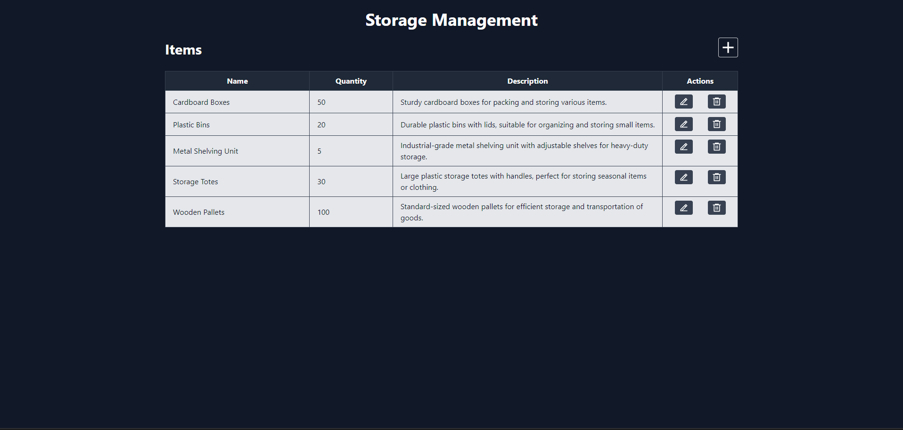
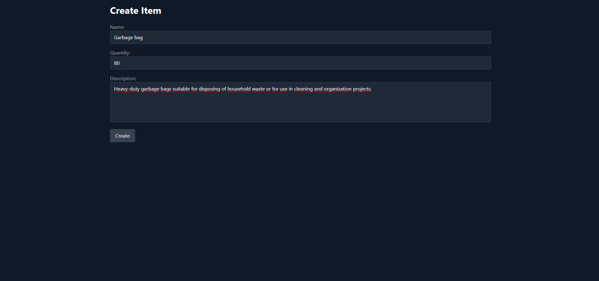
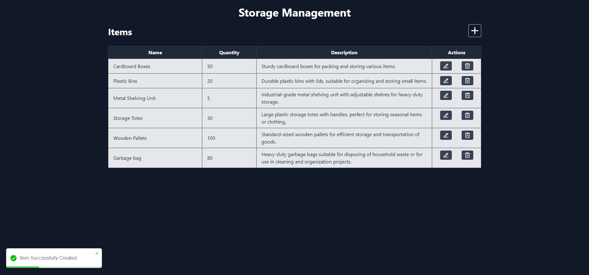
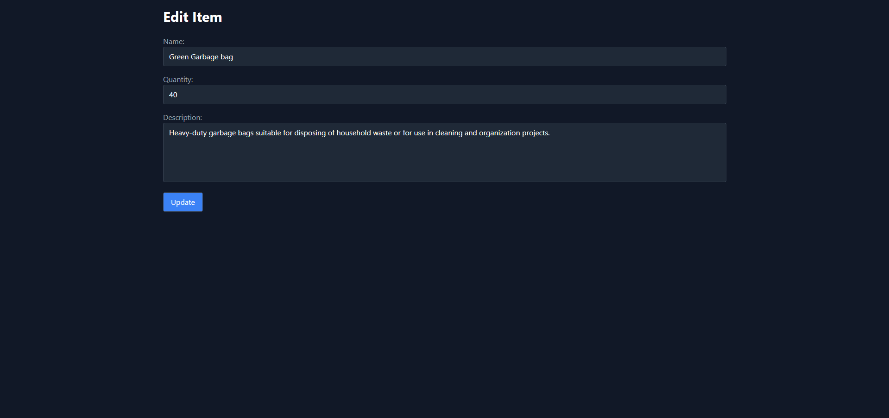
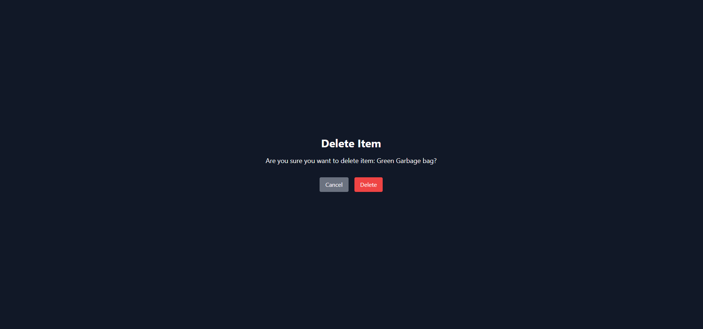

# Full-Stack Storage Management App

## Table of Contents

1. [Introduction](#introduction)
2. [Tech Stack](#tech-stack)
3. [Installation and Usage](#installation-and-usage)
4. [Screenshots](#screenshots)

## Introduction

Full-Stack Storage Management App. This project is bulit with MERN (MongoDB, Express.js, React.js, Node.js) stack. This project was primarily build to improve my MERN stack development skills.

## Tech Stack

### Frontend

- React
- React Icons
- React Router DOM
- Axios
- Tailwind CSS
- React Toastify

### Backend

- Express.js
- Mongoose

## Installation and Usage

### Prerequisites

- Node.js version 18.17.1 or later
- MongoDB Atlas account or local MongoDB server running

### Installation

1. Clone the repository to your local machine:

```bash
git clone https://github.com/omerfarukgulhan/storage-management--mern-stack.git
```

2. Start the server:

```bash
cd server
npm install
npm run dev
```

3. Start the web app:

```bash
cd client
npm install
npm run dev
```

After these steps go to `http://localhost:5173`

## Screenshots

### Home Page



### Creat Item



### Item Added



### Edit Item



### Delete Item


